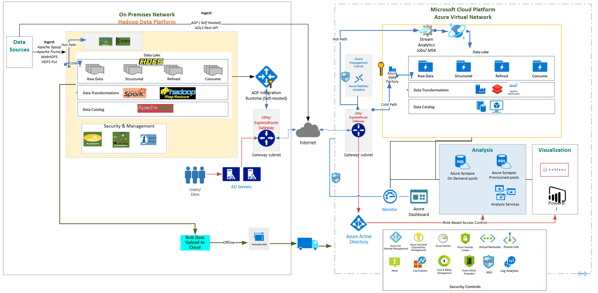
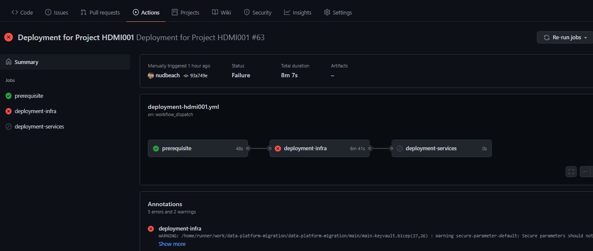
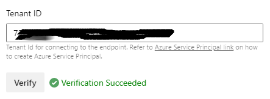
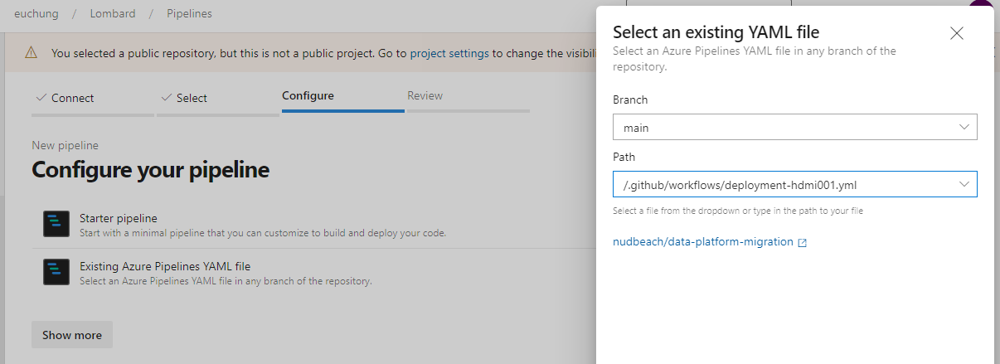

# Hadoop Migration - Data Platform Migration
This is for Hadoop-Migrations, https://github.com/Azure/Hadoop-Migrations

> **General disclaimer** Please be aware that this template is in private preview. Therefore, expect smaller bugs and issues when working with the solution. Please submit an Issue in GitHub if you come across any issues that you would like us to fix.

[//]: # (**DO NOT COPY - UNDER DEVELOPMENT - MS INTERNAL ONLY - Please be aware that this template is in private preview without any SLA.**)
**DO NOT COPY - UNDER DEVELOPMENT - Please be aware that this template is in private preview without any SLA.**

**** to-be-updated ****

## Description
This is for Hadoop-Migrations

**** to-be-updated ****

## What will be deployed?

By default, all the services which come under the reference architecture are enabled, and you must explicitly disable services that you don't want to be deployed from parameters which prompts in the ARM screen at portal or in the template files  `*.parameters.json` or directly in `*.bicep` 

> Note: Before deploying the resources, we recommend to check registration status of the required resource providers in your subscription. For more information, see [Resource providers for Azure services.](https://docs.microsoft.com/azure/azure-resource-manager/management/resource-providers-and-types)




For the reference architecture, the following services are created

- HDInsight
- [Synapse Workspace](https://docs.microsoft.com/azure/synapse-analytics/)
- Azure Databrick
- [Data Factory](https://docs.microsoft.com/azure/data-factory/)
- [Cosmos DB](https://docs.microsoft.com/azure/cosmos-db/introduction)
- Infrastructure
  * [Key Vault](https://docs.microsoft.com/azure/key-vault/general)
  * VNet
  * VM
  * Private DNS Zone

For more details regarding the services that will be deployed, please read the Domains guide in the Hardoop Migration documentation.

## Before you start 

If you don't have an Azure subscription, [create your Azure free account today.](https://azure.microsoft.com/free/)

Components to install

1. Azure CLI
2. Bicep

Things you need to prepare 

1. Resource Group
2. Service Principal and access
3. Public Key for SSH (Optional)

### 1. Resource Group

You need to login first from CLI

```command
az login
```

You'll get prompts at your web brower, if authentication's done successfully, you'll get something like this

```javascript
  {
    "cloudName": "AzureCloud",
    "homeTenantId": "xxxxxxxx-xxxx-xxxx-xxxx-xxxxxxxxxxxx",
    "id": "xxxxxxxx-xxxx-xxxx-xxxx-xxxxxxxxxxxx",
    "isDefault": true,
    "managedByTenants": [],
    "name": "xxxxxxxxxxxx",
    "state": "Enabled",
    "tenantId": "xxxxxxxx-xxxx-xxxx-xxxx-xxxxxxxxxxxx",
    "user": {
      "name": "xxxxxxx@xxxxxxxxx.com",
      "type": "user"
    }
  },
```

Get the subscription `id` from login result

Create a resource group by running this

```commands
az group create -l <Your Region> -n <Resource Group Name> --subscription <Your Subscription Id>
```

### 2. Service Principal and access

A service principal needs to be generated for authentication and authorization by Key Vault. Just go to the Azure Portal to find the ID of your subscription. Then start the Cloud Shell or Azure CLI, login to Azure, set the Azure context and execute the following commands to generate the required credentials:

> Note: The purpose of this new Service Principal is to assign least-privilege rights. Therefore, it requires the Contributor role at a resource group scope in order to deploy the resources inside the resource group dedicated to a specific data domain. The Network Contributor role assignment is required as well in this repository in order to assign the resources to the dedicated subnet.

**** to-be-updated ****

```commands
az ad sp create-for-rbac -n <Your App Name>
```

Then you'll get something like this

```javascript
{
  "appId": "xxxxxxxx-xxxx-xxxx-xxxx-xxxxxxxxxxxx",
  "displayName": "<Your App Name>",
  "name": "http://<Your App Name>",
  "password": "xxxxxxxxxxxxxxxxxxxxxxxxxxxxxxxxxx",
  "tenant": "xxxxxxxx-xxxx-xxxx-xxxx-xxxxxxxxxxxx"
}
```

Keep your `appId` and `password` for the following steps

### 3. Public Key for SSH

It's optional only when you want to deploy VMs at VNets for test

[To create and use an SSH public-private key pair for Linux VMs in Azure](https://docs.microsoft.com/en-us/azure/virtual-machines/linux/mac-create-ssh-keys)

```commands
cat ~/.ssh/id_rsa.pub
```

Keep your public key string for the following steps

### Supported Regions

Most of regions where data & analytic components are available, please choose one of regions before you start

## Options to run

Options for deploying this reference architecture

1. Oneclick button to Quickstart
2. CLI
3. Github Action 
4. Azure DevOps Pipeline

## 1. Quickstart Button

- Infrastructure

[](https://portal.azure.com/#create/Microsoft.Template/uri/https%3A%2F%2Fraw.githubusercontent.com%2Fnudbeach%2Fdata-platform-migration%2Fmain%2Fbuild%2Fmain-infra.json) 
[](http://armviz.io/#/?load=https%3A%2F%2Fraw.githubusercontent.com%2Fnudbeach%2Fdata-platform-migration%2Fmain%2Fbuild%2Fmain-infra.json)

- Key Vault

[](https://portal.azure.com/#create/Microsoft.Template/uri/https%3A%2F%2Fraw.githubusercontent.com%2Fnudbeach%2Fdata-platform-migration%2Fmain%2Fbuild%2Fmain-keyvault.json) 
[](http://armviz.io/#/?load=https%3A%2F%2Fraw.githubusercontent.com%2Fnudbeach%2Fdata-platform-migration%2Fmain%2Fbuild%2Fmain-keyvault.json)

- Services all-at-once

[](https://portal.azure.com/#create/Microsoft.Template/uri/https%3A%2F%2Fraw.githubusercontent.com%2Fnudbeach%2Fdata-platform-migration%2Fmain%2Fbuild%2Fmain-service-all-at-once.json) 
[](http://armviz.io/#/?load=https%3A%2F%2Fraw.githubusercontent.com%2Fnudbeach%2Fdata-platform-migration%2Fmain%2Fbuild%2Fmain-service-all-at-once.json)

[//]: # (## 2. Github Action, ## 3. Azure DevOps Action)

## 2. Deploying using CLI

Doublecheck if you've logged in. 

```command
az login
```
Clone this repo to your environment

```command
git clone https://github.com/nudbeach/data-platform-migration.git
```

You can run all following commands at home directory of `data-platform-migration`
Create a resource group with location using your subscription id from previous step

```command
az group create -l koreacentral -n <Your Resource Group Name> \
 --subscription xxxxxxxx-xxxx-xxxx-xxxx-xxxxxxxxxxxx
```
Deploy components by running these commands sequentially

```command
az deployment group create -g <Your Resource Group Name> -f main/main-infra.bicep

az deployment group create -g <Your Resource Group Name> -f main/main-keyvault.bicep

az deployment group create -g <Your Resource Group Name> -f main/main-service-all-at-once.bicep
```

or 

```command
az deployment group create -g <Your Resource Group Name> \
 -f main/main-infra.bicep \
 --parameter main/main-service-infra.json

az deployment group create -g <Your Resource Group Name> \
 -f main/main-service-keyvault.bicep \
 --parameter main/main-service-keyvault.json

az deployment group create -g <Your Resource Group Name> \
 -f main/main-service-all-at-once.bicep \
 --parameter main/main-service-all-at-once.parameters.json
```

`--parameter <parameter filename>` is optional


or after you run `./build.sh` from command line,

```command
az deployment group create -g <Your Resource Group Name> \
 -f build/main-infra.json \
 --parameter build/main-service-infra.json

az deployment group create -g <Your Resource Group Name> \
 -f build/main-service-keyvault.json \
 --parameter build/main-service-keyvault.json

az deployment group create -g <Your Resource Group Name> \
 -f build/main-service-all-at-once.json \
 --parameter build/main-service-all-at-once.parameters.json
```

## 3. Deploying using Github Action with automation

This option consists of 3 steps

1. Role assignments to Service Principal
2. Setting up AZURE_CREDENTIAL
3. Pipeline implementation
4. Running Workflow

### 1. Role assignments to Service Principal

In the previous step, you've already got a Service Principal which's for Key Vault. But we're going to create another one for client authentication backed by Azure AD which's dedicated to GitHub Action and Azure DevOps Pipeline

```commands
az ad sp create-for-rbac --name <Your App Name -2> --role contributor \
 --scopes <Your Resource Group Id> \
 --role contributor --sdk-auth
```

`<Your App Name -2>` is different name to previous one. Then you'll get something like this

```javascript
{
  "clientId": "xxxxxxxx-xxxx-xxxx-xxxx-xxxxxxxxxxxx",
  "clientSecret": "xxxxxxxxxxxxxxxxxxxxxxxxxxxxxxxxxx",
  "subscriptionId": "xxxxxxxx-xxxx-xxxx-xxxx-xxxxxxxxxxxx",
  "tenantId": "xxxxxxxx-xxxx-xxxx-xxxx-xxxxxxxxxxxx",
  "activeDirectoryEndpointUrl": "https://login.microsoftonline.com",
  "resourceManagerEndpointUrl": "https://management.azure.com/",
  "activeDirectoryGraphResourceId": "https://graph.windows.net/",
  "sqlManagementEndpointUrl": "https://management.core.windows.net:8443/",
  "galleryEndpointUrl": "https://gallery.azure.com/",
  "managementEndpointUrl": "https://management.core.windows.net/"
}
```

Keep entire Jason document for next step. And it has to be assigned all required role to this brand new service principal

- Contributor
- Private DNS Zone Contributor
- Network Contributor
- User Access Administrator

User Access Administrator is for role assignment for data platform services to storage account.

```commands
az role assignment create \
 --assignee "xxxxxxxx-xxxx-xxxx-xxxx-xxxxxxxxxxxx" \
 --role "<Role Name>" \
 --resource-group <Your Resource Group>
```

Run this commands for required roled listed above to your resource groups separately. Or run this command from your command line

```commands
./roleassign.sh <Your App Name -2> <Your Resource Group Name>
```

### 2. Setting up AZURE_CREDENTIAL

Next step is now you need to let GitHub Action authenticate for all access to your resources. This is simple. Before you do this, I recommend you to fork the repo under your GitHub account so that you can easily update actions
From Setting menu on the repo, goto secrets, and click on 'New Repository Secret'. And put the name as AZURE_CREDENTIAL, paste entire Jason document to value which you got from previous step. And 'Add Secrete' Button at below. From now on, all acces to your resources on Azure will be authenticated by using this token


### 3. Pipeline implementation

Checkout your repo which forked from [data-platform-migration](https://github.com/nudbeach/data-platform-migration) and go to `.github/workflows`. Open the workflow file, 'deployment-hdmi001.yml' and simply update environment variables with yours

- AZURE_SUBSCRIPTION_ID
- AZURE_RESOURCE_GROUP_NAME
- AZURE_LOCATION

You can externalize these environment variables to env file. See [this](https://docs.github.com/en/actions/reference/workflow-commands-for-github-actions#setting-an-environment-variable) for further details

Run this command from your command line to update to your repo

```commands
git add . ; git commit -m "my first commit" ; git push
```

In this example, it only manually works by `workflow_dispatch` event, it never automatically runs by pull and push events. You can do this by un-remarking initial parts like this

```javascript
# Controls when the action will run. 
on:
  # Triggers the workflow on push or pull request events but only for the main branch
  push:
    branches: [ main ]
  pull_request:
    branches: [ main ]
```

### 4. Running Workflow

Go to 'Actions' item on your repo, and click on 'Deployment for Project HDMI001'. And click on 'Run Workflow' on the right


Now you can see the running workflow




## 4. Deploying using Azure DevOps with automation

Both GitHub Action and Azure DevOps looks similar in terms of structure and concepts but not 100% the same each other.Comparing with instructions in GitHub Action, you can reuse most of things that you've created at the intial steps 'Role assignments to Service Principal' and 'Setting up AZURE_CREDENTIAL'. For 'Pipeline implementation' step, there's a few differences in syntax of workflow, for example `on`, `env` are not supported in Azure DevOps, you can just remove them and externalize them to "Environment" and "Variables". 
So I would recommend you to make a repo copy to Azure DevOps before you start

1. Create Azure ARM connection
2. Configure your Pipeline
3. Run the pieline

### 1. Create Azure ARM connection

First of all, create and get your project and select it. From "Project Settings" at the bottom left, go to "Service Connection" and click on "New Service Connection" at top right

In the "New Service Connection" tab, select "Azure Resource Manager", and select "Next"

Select "Service principal (manual)" and clock on "Next"


From "New Azure service connection" tab, select "Subscription", input your Subscriotion id and Subscriotion id, Enter details with service principal that we have generated in GitHub Actionconfig. 

- Service Principal Id = clientId
- Service Principal Key = clientSecret
- Tenant ID = tenantId

And click on Verify to make sure that the connection works. 



Input your user-friendly connection name to use when referring to this service connection and description if you want. Take note of the name because this will be required in the parameter update process.

That's it

### 2. Configure your Pipeline

Go to Pipelines, click on "New Pipeline" button on top right.

Select "Azure Repo Git" if you've already made clone to your repo, or you can select Github to connect to your repo which's forked from this repo



Select "Existing Azure Pipelines YAML file", then you'll see the Github Action workflow file under `.github/workflows`, in the next step, you can make some changes directly on the web UI so that you can configure your pipeline and try to test it 

## Known issues

### Warning: no-unused-params

**Warning Message:**
```text wrap
data-platform-migration/modules/create-vnets-with-peering/azuredeploy.bicep(25,7) : Warning no-unused-params: Parameter is declared but never used. [https://aka.ms/bicep/linter/no-unused-params]
data-platform-migration/modules/create-vnets-with-peering/azuredeploy.bicep(28,7) : Warning no-unused-params: Parameter is declared but never used. [https://aka.ms/bicep/linter/no-unused-params]
data-platform-migration/modules/create-private-dns-zone/azuredeploy.bicep(11,7) : Warning no-unused-params: Parameter is declared but never used. [https://aka.ms/bicep/linter/no-unused-params]
data-platform-migration/modules/create-private-dns-zone/azuredeploy.bicep(14,7) : Warning no-unused-params: Parameter is declared but never used. [https://aka.ms/bicep/linter/no-unused-params]
data-platform-migration/modules/create-vm-simple-linux/azuredeploy.bicep(19,7) : Warning no-unused-params: Parameter is declared but never used. [https://aka.ms/bicep/linter/no-unused-params]
```

**Solution:**
Simply ignore these warnings. It's because of optional settings for VM, HDI, Synapse and so on. If you set these false, all corresponding parameters for these creations are not gonna get used. You can just ignore these when you try this with CLI or Quick Start Button but in Git Hub Action or Azure DevOps pipeline, you need to skip this warnings by adding `continue-on-error: true` to Jobs or Steps. That's because current version of deployment agent in Azure CLI detects it's an error than warning. It's `Bicep CLI version 0.3.255 (589f0375df)` for now. 

The warning is to guide to reduce confusion in your template, delete any parameters that are defined but not used. This test finds any parameters that aren't used anywhere in the template. Eliminating unused parameters also makes it easier to deploy your template because you don't have to provide unnecessary values. You can find further details from [here](https://aka.ms/bicep/linter/no-unused-params)

## Contributing

This project welcomes contributions and suggestions. Most contributions require you to agree to a Contributor License Agreement (CLA) declaring that you have the right to, and actually do, grant us the rights to use your contribution. For details, visit <https://cla.opensource.microsoft.com>.

When you submit a pull request, a CLA bot will automatically determine whether you need to provide a CLA and decorate the PR appropriately (e.g., status check, comment). Simply follow the instructions provided by the bot. You will only need to do this once across all repositories using our CLA.

[//]: # (This project has adopted the [Microsoft Open Source Code of Conduct](https://opensource.microsoft.com/codeofconduct/). For more information see the [Code of Conduct FAQ](https://opensource.microsoft.com/codeofconduct/faq/) or contact [opencode@microsoft.com](mailto:opencode@microsoft.com) with any additional questions or comments.)